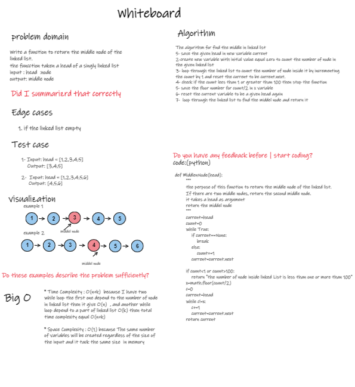

## Challenge01 - Find Middle Node:
1. creat a node by use class oop .
2. creat a Linkedlist class and append the node by use append () method that take a node as argument.
3. creat a MiddlenNode function that find the middle node in linked list  .by taken a head node as argument, this function return the mid node .
4. creat a middel_node method insid the linkedlist class to print a list contain a value for the mid node and the next nodes .
5. 

 ### whiteboard
