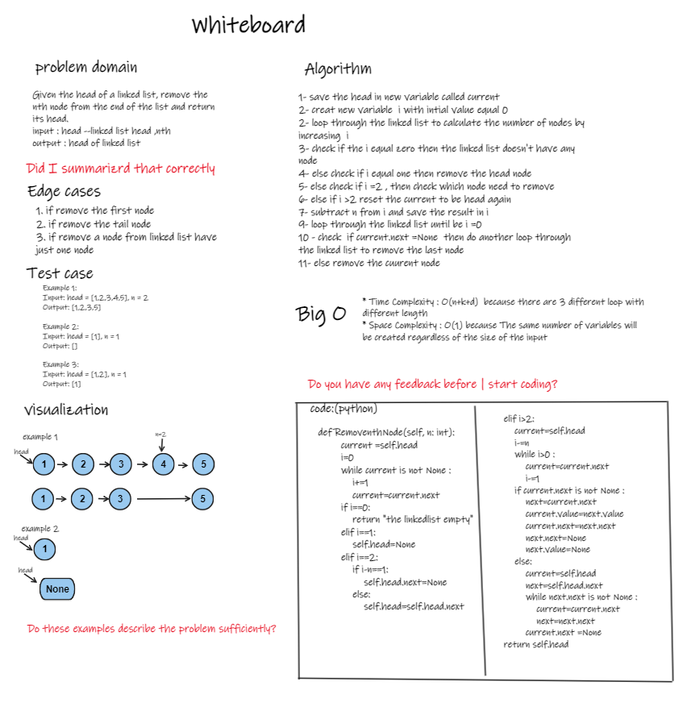

## Challenge01 - Find Middle Node:
1. creat a node by use class oop .
2. creat a Linkedlist class and append the node by use append () method that take a node as argument.
3. call a RemoventhNode method that remove the nth node from the end of the linkedlist and return its head it takes  nth return the head
4. call the printAll method to print all the node's value in the linked list as list
   
 ### whiteboard
