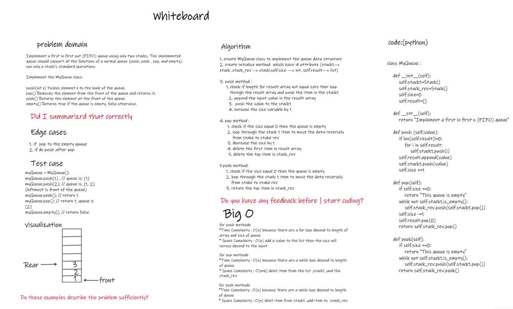

# Queue :

## Challenge01 - Implement Queue Using Stack
1. creat stack class 
2. creat MyQueue  class to Implement a first in first out (FIFO) queue using only two stacks. which have this methode : 
    * ( __str__(),push(), peek() , pop(), and empty()).

3. test my function by using pytest, and create a test function inside test_Challenge01.py with fixture. 

### WhiteBoard 

